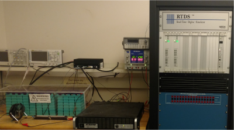

## Overview 

This project is based on the practical observation that in a battery pack the capacity of some damaged cells impact the entire pack capacity. 
The project included several practial experimental studies using an aged battery pack.
The links to the experimental data are included in the data directory. 

TBD

## Data Description

Here is a summary description of the battery data that was measured during the experiments.

## Included/ Ignored Files
This projects include these types of files:

* codes : matlab m file
* data  :  .csv (ignored) .mat(ignored)  [should provide a link for them in repo]
* simulation results :  .mat (ignored) .fig (ignored) [should provide a link for them in repo]
* report : latex (include)  eps (include) bib (include)